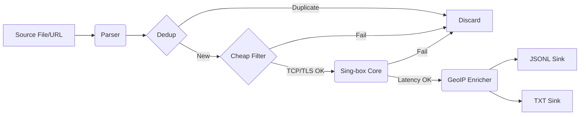

# Find Me Internet 🌐

**Find Me Internet** is a high-performance, scalable proxy scanner and tester written in Go. It is designed to ingest thousands of proxy links (VLESS, VMess, Trojan, Reality, etc.) from files or URLs, filter out dead nodes efficiently using "cheap" network checks, and rigorously test survivors using a real **Sing-box** core.

It uses a "Funnel Architecture" to minimize resource usage, allowing it to scan 100,000+ proxies without crashing your system.

## 🚀 Architecture

The system processes proxies through a multi-stage pipeline:



## 🛠️ Prerequisites

1. **Go 1.21+** installed.
2. **Sing-box Binary:** The engine that powers the tests.
3. **GeoLite2 Database (Optional):** For country detection.

## 📦 Installation

### 1. Clone & Dependencies

```bash
git clone https://github.com/sajadMRjl/find-me-internet.git
cd find-me-internet
go mod tidy

```

### 2. Install Sing-box

Download the latest release for your OS from [Sing-box Releases](https://github.com/SagerNet/sing-box/releases).

- Extract the binary.
- Place it in the `./bin/` folder (or anywhere you like).
- _Linux/macOS:_ Ensure it is executable: `chmod +x ./bin/sing-box`

### 3. Setup GeoIP (Optional)

- Register for a free MaxMind account.
- Download the `GeoLite2-Country.mmdb`.
- Place it in `./data/`.

## ⚙️ Configuration

Create a `.env` file in the root directory:

```ini
# --- General ---
LOG_LEVEL=INFO           # Options: DEBUG, INFO, WARN, ERROR
MAX_WORKERS=50           # Concurrency limit for Sing-box instances

# --- Timeouts ---
TCP_TIMEOUT=2s           # Max time for "Cheap" TCP connect
TEST_TIMEOUT=10s         # Max time for "Expensive" HTTP test
TEST_URL=http://cp.cloudflare.com  # The target to fetch

# --- Paths ---
SING_BOX_PATH=./bin/sing-box
INPUT_PATH=./data/proxies.txt            # Default input source
OUTPUT_PATH=./data/valid_proxies.jsonl   # Detailed output
TXT_OUTPUT_PATH=./data/valid_proxies.txt # Simple list output
GEOIP_PATH=./data/GeoLite2-Country.mmdb

```

## 🏃 Usage

You can run the scanner in three ways:

### 1. Default Mode

Reads the input path defined in your `.env` file (`INPUT_PATH`).

```bash
go run cmd/main.go

```

### 2. File Override

Pass a specific local file path as an argument.

```bash
go run cmd/main.go ./my_new_proxies.txt

```

### 3. URL Streaming

Pass a URL (starting with `http://` or `https://`) to fetch and scan a remote subscription directly.

```bash
go run cmd/main.go https://raw.githubusercontent.com/example/proxies/main/list.txt

```


## 📊 Viewing Results

The scanner generates two output files in your `data/` folder:

1. **valid_proxies.txt**: A clean list of working proxy links, ready to copy-paste into V2Ray clients.
2. **valid_proxies.jsonl**: Detailed JSON logs for analysis.

```bash
# Watch results in real-time
tail -f data/valid_proxies.jsonl

```

### Output Example (JSONL)

```json
{"link":"vless://uuid@1.2.3.4:443...","type":"vless","address":"1.2.3.4","port":443,"latency_ms":145,"country":"DE"}
{"link":"vmess://...","type":"vmess","address":"5.6.7.8","port":80,"latency_ms":210,"country":"US"}

```

## ⚠️ Disclaimer

This tool is for educational purposes and network analysis only. The user is responsible for ensuring they have permission to test the networks and proxies they scan.
